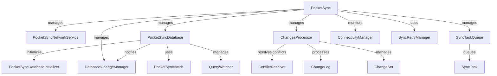

# PocketSync Architecture

This document outlines the architecture and component interactions of the PocketSync Flutter library.

## Component Interaction Diagram

## Component Responsibilities

### Core components

#### PocketSync
- Central orchestrator of the sync engine
- Manages initialization and configuration
- Coordinates sync operations between local and remote databases
- Handles user authentication and session management

#### PocketSyncDatabase
- Manages local SQLite database operations
- Tracks changes through triggers and change logs
- Provides transaction support and batch operations
- Implements query watching for real-time updates

#### ChangesProcessor
- Processes local and remote changes
- Handles conflict resolution
- Manages change queue and batching
- Ensures data consistency

### Supporting Services

#### ConnectivityManager
- Monitors network connectivity
- Triggers sync operations when connection is available
- Manages offline operation mode

#### DatabaseChangeManager
- Tracks database modifications
- Notifies observers of changes
- Manages change propagation

#### SyncTaskQueue
- Queues and prioritizes sync operations
- Ensures ordered execution of sync tasks
- Handles retry logic for failed operations

### Data Models

#### ChangeSet
- Represents a collection of changes
- Contains table-specific modifications
- Tracks version information

#### ChangeLog
- Records individual database changes
- Stores operation type and timestamp
- Maintains sync status

## Data Flow

1. Local changes are captured by PocketSyncDatabase through triggers
2. DatabaseChangeManager notifies observers of modifications
3. ChangesProcessor prepares changes for sync
4. SyncTaskQueue manages the order of sync operations
5. PocketSyncNetworkService sends changes to remote server
6. Incoming remote changes are processed and applied locally
7. Conflicts are resolved using the configured ConflictResolver

## Key Features

- Automatic change tracking
- Offline-first operation
- Conflict resolution
- Real-time query updates
- Batch operations support
- Transactional integrity
- Retry mechanism for failed operations

## Configuration

The sync engine can be configured through PocketSyncOptions:
- Project identification
- Authentication
- Server endpoints
- Conflict resolution strategy
- Logging preferences